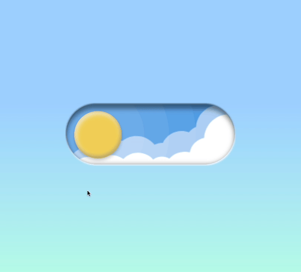

[](https://central.sonatype.com/artifact/com.akexorcist.kotlin.multiplatform/dayandnight)


# Day & Night Switch
Realistic and fancy switch that is inspired by a popular meme about Designer vs. Developer



See an example on [GitHub Pages](https://akexorcist.github.io/day-and-night-switch)

## Highlight
* No image. All of UI components are written by Compose Multiplatform!
* Realistic light and shadow

## Powered by
* [Kotlin Multiplatform](https://www.jetbrains.com/kotlin-multiplatform/)
* [Compose Multiplatform](https://www.jetbrains.com/lp/compose-multiplatform/)

## Usage
```kotlin
val version = "1.0.1"

// Common
implementation("com.akexorcist.kotlin.multiplatform:dayandnight:$version")

// Android
implementation("com.akexorcist.kotlin.multiplatform:dayandnight-android:$version")

// iOS
implementation("com.akexorcist.kotlin.multiplatform:dayandnight-iosx64:$version")
implementation("com.akexorcist.kotlin.multiplatform:dayandnight-iosarm64:$version")
implementation("com.akexorcist.kotlin.multiplatform:dayandnight-iossimulatorarm64:$version")

// Desktop
implementation("com.akexorcist.kotlin.multiplatform:dayandnight-desktop:$version")

// WebAssembly
implementation("com.akexorcist.kotlin.multiplatform:dayandnight-wasm-js:$version")
```

```kotlin
var selected by remember { mutableStateOf(true) }

// Switch Only
DayAndNightSwitch(
  modifier = Modifier,
  selected = selected,
  onSwitchToggle = { selected = !selected },
)

// With Container
DayAndNightContainer(
    modifier = Modifier.fillMaxSize(),
    selected = selected,
) {
    DayAndNightSwitch(
        modifier = Modifier.scale(2f),
        selected = selected,
        onSwitchToggle = { selected = !selected },
    )
}
```

## Run example
* **Android**: Run at example module with Android App configuration
* **Desktop**: Run `gradlew desktopRun -DmainClass=MainKt --quiet`
* **WebAssembly**: Run `gradlew wasmJsBrowserDevelopmentRun`
* **iOS**:
  * Run `gradlew build commonizeNativeDistribution`
  * Open `./iosApp/iosApp.xcodeproj` with Xcode
  * Run the app on Xcode

## Design reference
* https://designer-vs-developer-meme-with-sound.webflow.io/

## License
[Apache License Version 2.0](./LICENSE)
